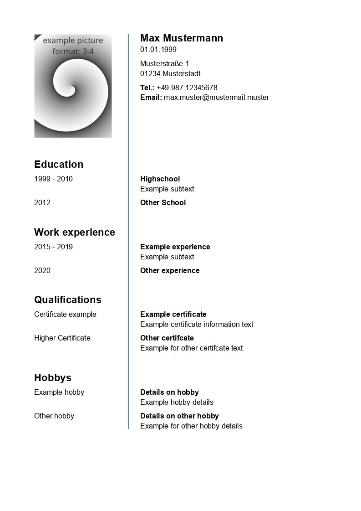

# Resume Template



# Usage
```
git clone https://github.com/Brezelfalter/resume.git
```

In case you name your file differently (not using the blank example), you need to change the import path listed at the top of `resume.typ`.
This needs to be updated if you do not use the standard blank example file.

All contents of a resume should be defined within `versions/your-resume-filename.typ` while following the templates given in the same folder.
Personal information as shown in the top right corner as well as the path to the picture can be defined within this file too.

The files containing the actual content have an `entries` section where each grouping of entries within the resume is listed in the correct order.
Each grouping should start with `heading()`, followed by any amount of `entry()` parts, containing the to be listed contents for this group. 


## Creating a pdf file
This works like basic typst. 
You can either run 
```
typst compile resume.typ
```
to compile the pdf once, or you can run
```
typst watch resume.typ
```
to have typst update the file in real time, whenever it is saved.